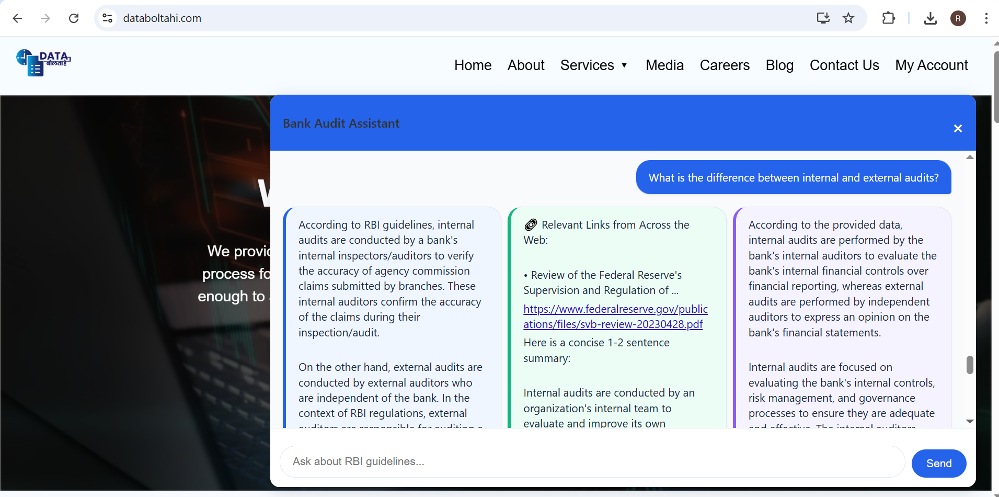

# Rbi-catbot

# 🚀 AI-Powered Document Assistant  

A FastAPI-based API for document processing, retrieval, and AI-powered Q&A using LangChain, Groq, and ChromaDB.  

## ✨ Features  
- **Document Processing**: Extract text from PDFs.  
- **Vector Embeddings**: Store and retrieve documents efficiently using ChromaDB.  
- **AI-Powered Q&A**: Leverage LLMs (via Groq/LangChain) for contextual answers.  
- **Web Search Integration**: Augment responses with real-time web data.  

## 📦 Installation  

1. **Clone the repository**:  
   ```bash
   git clone https://github.com/yourusername/your-repo.git
   cd your-repo
   ```

2. **Set up a virtual environment** (recommended):  
   ```bash
   python -m venv venv
   source venv/bin/activate  # Linux/Mac
   venv\Scripts\activate    # Windows
   ```

3. **Install dependencies**:  
   ```bash
   pip install -r requirements.txt
   ```

## 🔧 Configuration  

1. **Environment Variables**:  
   Create a `.env` file in the root directory with your API keys:  
   ```env
   GROQ_API_KEY="your-groq-api-key"
   HUGGINGFACEHUB_API_TOKEN="your-hf-token"
   ```

2. **Optional**: Modify `config.py` (if included) for custom settings like:  
   - Default LLM model (`llama3-70b-8192` by default).  
   - Chunk size/splitting behavior.  

## � Usage  

### Running the API  
```bash
uvicorn main:app --reload
```  
Access the interactive docs at `http://localhost:8000/docs`.  

### Endpoints  
- **POST `/upload`**: Upload and process a PDF.  
- **POST `/ask`**: Submit a query (text or voice) for AI response.  

Example `curl` for `/ask`:  
```bash
curl -X POST "http://localhost:8000/ask" \
-H "Content-Type: application/json" \
-d '{"question": "Summarize this document", "document_id": "123"}'
```

## 🌟 Advanced  
- **Custom Models**: Swap out Groq for OpenAI, Anthropic, or local models via `langchain-community`.  
- **Voice Input**: Use `speech-recognition` (add to `requirements.txt`) for audio queries.  

## 📸 Example Output

Here is an example of the output you can expect from the API:


